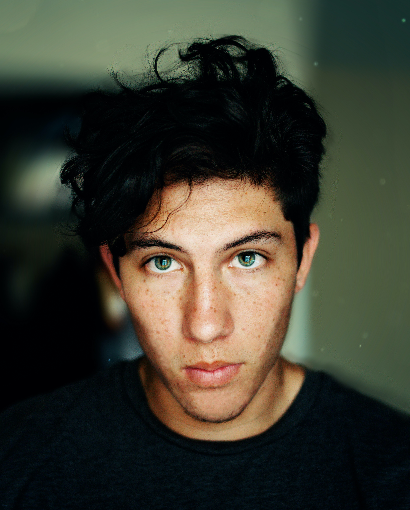
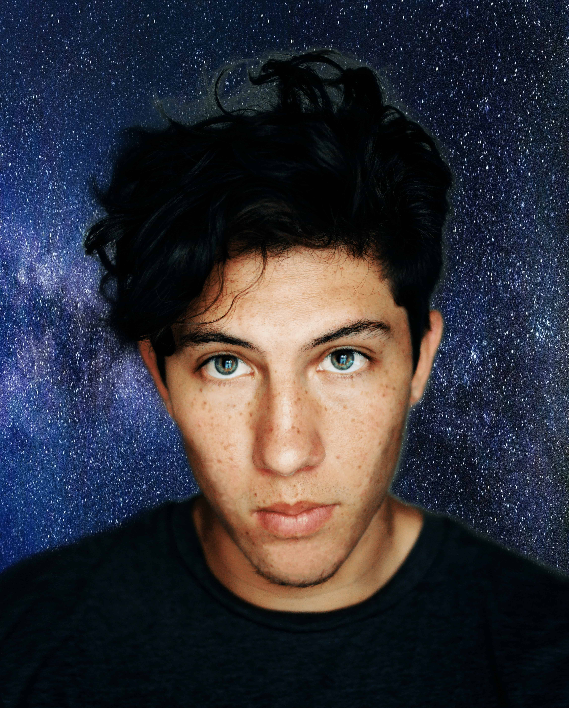
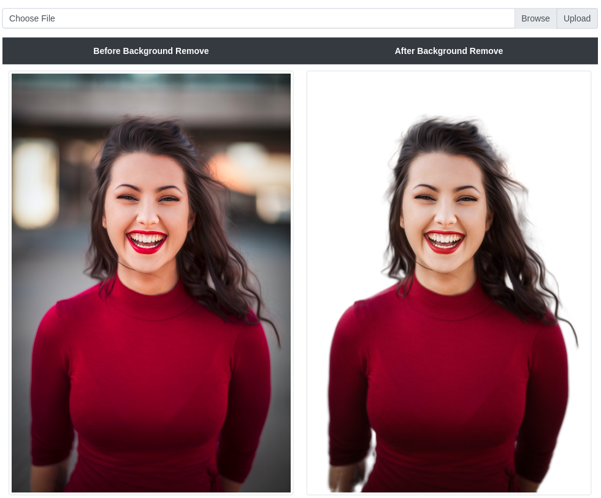

# MODNet Background Remover

## Application

A deep learning approach to remove background and adding new background image

- Remove background from **images,videos & live webcam**
- Adding new background to those **images,videos & webcam footage**

### Demo

<table>
<tr align="center">
<td><b>Before removing the background</b></td>
<td><b>After replacing the background with new image</b></td>
</tr>
<tr align="center">
<td></td>
<td></td>
</tr>
<tr align="center">
<td><b>Before removing the background from video</b></td>
<td><b>After replacing the background with new image in this video</b></td>
</tr>
<tr align="center">
<td colspan=2></td>
</tr>
<table>

### Web View
<table>
<tr align="center">
<td><b>Before removing the background</b></td>
<td><b>After removing the background</b></td>
</tr>
<tr align="center">
<td></td>
<td></td>
</tr>
<table>

## Installation

### Python Version

- Python == 3.8

### Virtual Environment

#### Windows

- `python -m venv venv`
- `.\venv\Scripts\activate`
- If any problem for scripts activation
  - Execute following command in administration mode
    - `Set-ExecutionPolicy Unrestricted -Force`
  - Later you can revert the change
    - `Set-ExecutionPolicy restricted -Force`

#### Linux

- `python -m venv venv`
- `source venv/bin/activate`

### Library Installation

- Library Install
  - `pip install --upgrade pip`
  - `pip install --upgrade setuptools`
  - `pip install -r requirements.txt`
  - To run in **web interface**
    - `pip install -r web_requirements.txt`

### Pretrained Weights Download
- [Weights Detail](pretrained/README.md)

## Inference

### Image

#### Single image

It will generate the output file in **output/** folder

- `python inference.py --image image_path` **[Without background image]**
- `python inference.py --image image_path --background True` **[With background image]**
- Example:
  - `python inference.py --image assets/sample_image/female.jpeg`
  - `python inference.py --image assets/sample_image/male.jpeg --background True`

#### Folder of images

It will generate the output file in **output/** folder

- `python inference.py --folder folder_path` **[Without background image]**
- `python inference.py --folder folder_path --background True` **[With background image]**
- Example:
  - `python inference.py --folder assets/sample_image/`
  - `python inference.py --folder assets/sample_image/ --background True`

### Video

It will generate the output file in **output/** folder

- `python inference.py --video video_path` **[Without background image]**
- `python inference.py --video video_path --background True` **[With background image]**
- Example:
  - `python inference.py --video assets/sample_video/sample.mp4`
  - `python inference.py --video assets/sample_video/sample.mp4 --background True`

### Webcam

- `python inference.py --webcam True` **[Without background image]**
- `python inference.py --webcam True --background True` **[With background image]**

### Webinterface

- `python api.py`
- Click on this [link/localhost](http://127.0.0.1:8000)
- Upload the image and wait

## Reference

- [A Trimap-Free Solution for Portrait Matting in Real Time under Changing Scenes](https://github.com/ZHKKKe/MODNet)
- Sample Female photo by <a href="https://unsplash.com/@michaeldam?utm_source=unsplash&amp;utm_medium=referral&amp;utm_content=creditCopyText">Michael Dam</a> on <a href="https://unsplash.com/?utm_source=unsplash&amp;utm_medium=referral&amp;utm_content=creditCopyText">Unsplash</a>
- Sample Male photo by  <a href="https://unsplash.com/@erik_lucatero?utm_source=unsplash&amp;utm_medium=referral&amp;utm_content=creditCopyText">Erik Lucatero</a> on <a href="https://unsplash.com/?utm_source=unsplash&amp;utm_medium=referral&amp;utm_content=creditCopyText">Unsplash</a>
