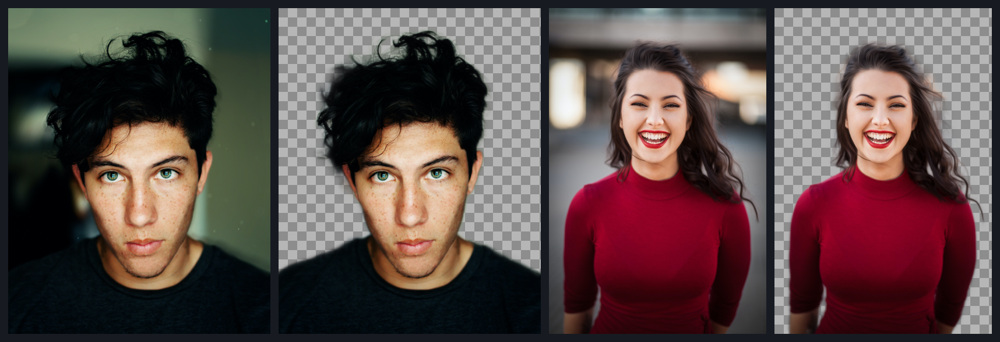

# MODNet Background Remover

Remove the background from photos and videos in your browser. Everything runs
locally — nothing is uploaded anywhere.



- Images and video, plus live camera capture
- Transparent, solid colour, blurred, custom image, or raw alpha matte output
- Draggable before/after comparison slider
- Batch upload with a zip download
- Runs on an NVIDIA GPU, an Apple GPU, or the CPU — switchable from the UI

## Requirements

The MODNet checkpoints are not distributed with this repository. Download
`modnet_photographic_portrait_matting.ckpt` and
`modnet_webcam_portrait_matting.ckpt` and put them in `weights/`:

```
weights/
  modnet_photographic_portrait_matting.ckpt
  modnet_webcam_portrait_matting.ckpt
```

Both files are verified against a pinned SHA-256 before they are loaded. A file
that does not match is rejected rather than used.

## Run it with Docker

```bash
docker compose up --build
```

Open <http://localhost:8000>.

On a machine with an NVIDIA GPU:

```bash
docker compose --profile cuda up --build web-cuda
```

The CUDA image is roughly 6GB; the default CPU image is roughly 1.5GB. Neither
contains the checkpoints — `weights/` is mounted read-only at runtime.

## Run it without Docker

```bash
pip install -e ".[dev]"
python -m flask --app "modnet_bg.web:create_app()" run --port 8000
```

## Configuration

| Variable | Default | Meaning |
|---|---|---|
| `MODNET_DEVICE` | `auto` | `auto`, `cuda`, `mps`, or `cpu`. `auto` prefers cuda, then mps, then cpu |
| `MODNET_WEIGHTS_DIR` | `./weights` | where the checkpoints live |
| `MODNET_WEIGHTS_URL_<KEY>` | unset | optional direct download URL per checkpoint |
| `PORT` | `8000` | listen port |
| `SECRET_KEY` | generated | set this in production |
| `MODNET_MAX_IMAGE_MB` | `25` | image upload cap |
| `MODNET_MAX_VIDEO_MB` | `250` | video upload cap |
| `MODNET_MAX_VIDEO_SECONDS` | `120` | video duration cap |
| `MODNET_MAX_WORKERS` | `2` | concurrent jobs |
| `MODNET_JOB_TTL_SECONDS` | `3600` | how long results are kept |

## Supported files

Images: PNG, JPEG, WebP, BMP, TIFF, GIF. Video: MP4, WebM, AVI, MOV, and
animated GIF.

Type is decided by the file's contents, not its extension, and multi-frame
containers are routed by frame count — a one-frame GIF is treated as a picture,
a sixty-frame GIF as a video.

Video output follows the mode: **Transparent** produces VP9 in WebM, because
H.264 has no alpha channel. Every other mode produces H.264 in MP4 with the
source's audio track carried over. Frame rate and dimensions always match the
source.

## About the GPU toggle

The device selector lists only what this machine actually has. Picking **CPU**
forces processing onto the CPU even when a GPU is present, which is useful for
comparison or when the GPU is busy. An unavailable choice falls back rather than
failing, and each result reports which device processed it.

## About the live camera

Camera matting runs one frame at a time through the model. Expect roughly **2–5
frames per second on a CPU** and 15–30 on CUDA — the readout under the canvas
shows the real measured rate. It is genuinely slow without a GPU.

## Development

```bash
pip install -e ".[dev]"
pytest                              # runs without any checkpoint present
ruff check modnet_bg tests
ruff format --check modnet_bg tests

pip freeze --exclude-editable | sed -E 's/\+[A-Za-z0-9][A-Za-z0-9.]*$//' > /tmp/reqs.txt
pip-audit --strict --desc -r /tmp/reqs.txt
```

The test suite substitutes a fake model, so it needs neither the checkpoints nor
a GPU. CI runs the same commands, plus builds both Docker images and smoke-tests
the CPU one.

## Licence and credit

MODNet is by Zhanghan Ke et al. The network in `modnet_bg/models/` is upstream
code, vendored unchanged.
